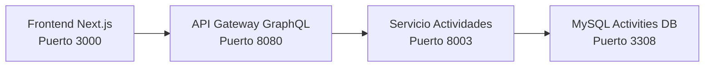

# Conexión Frontend con Servicio de Actividades

## 🏗️ Arquitectura del Sistema



## 📋 Resumen de la Conexión

El **frontend** de CourseClash ya está **completamente configurado** para conectarse con el servicio de actividades a través del API Gateway usando **GraphQL** y **Apollo Client**.

### ✅ Lo que YA está funcionando:

1. **API Gateway** expone endpoints GraphQL para actividades
2. **Frontend** tiene Apollo Client configurado
3. **Servicio de Actividades** funciona correctamente con REST
4. **Docker Compose** conecta todos los servicios

## 🚀 Cómo usar la conexión

### 1. **Queries disponibles:**

```typescript
// Obtener actividades de un curso
import { useActivitiesByCourse } from '@/lib/hooks/useActivities';

const { activities, loading, error } = useActivitiesByCourse('123');

// Obtener una actividad específica
import { useActivity } from '@/lib/hooks/useActivities';

const { activity, loading, error } = useActivity('456');

// Obtener entregas de una actividad
import { useSubmissions } from '@/lib/hooks/useActivities';

const { submissions, loading, error } = useSubmissions('456', 'userId', 'student');
```

### 2. **Mutations disponibles:**

```typescript
// Crear una actividad
import { useCreateActivity } from '@/lib/hooks/useActivities';

const { createActivity, loading } = useCreateActivity();

await createActivity({
  courseId: 123,
  title: "Tarea de Matemáticas",
  activityType: "task",
  description: "Resolver ejercicios del capítulo 5",
  dueDate: "2024-01-15T23:59:00Z"
});

// Crear una entrega
import { useCreateSubmission } from '@/lib/hooks/useActivities';

const { createSubmission, loading } = useCreateSubmission();

await createSubmission({
  activityId: 456,
  content: "Mi respuesta a la tarea",
  fileUrl: "https://example.com/mi-archivo.pdf"
});
```

## 🔧 Componentes Listos para Usar

### ActivityList Component

```tsx
import ActivityList from '@/components/activities/ActivityList';

// En tu página o componente
<ActivityList courseId="123" />
```

Este componente ya incluye:
- ✅ Lista de actividades del curso
- ✅ Estados de carga y error
- ✅ Botón para crear nueva actividad
- ✅ Interfaz responsive con Tailwind CSS

## 🌐 URLs y Configuración

### Desarrollo Local:
- **Frontend**: http://localhost:3000
- **API Gateway**: http://localhost:8080
- **GraphQL Playground**: http://localhost:8080/api/graphql
- **Servicio Actividades**: http://localhost:8003
- **Docs Actividades**: http://localhost:8003/docs

### Variables de Entorno:

```bash
# Frontend
NEXT_PUBLIC_API_GATEWAY_URL=http://localhost:8080

# API Gateway  
ACTIVITIES_SERVICE_URL=http://cc_activities_ms:8003
AUTH_SERVICE_URL=http://cc_auth_ms:8000
```

## 📊 Operaciones GraphQL Disponibles

### **Queries:**

| Operación | Descripción | Variables |
|-----------|-------------|-----------|
| `activity(id: String!)` | Obtiene una actividad por ID | `id: string` |
| `activities(idCourse: String!)` | Actividades de un curso | `idCourse: string` |
| `submissions(activityId: String!, userId: String!, userRole: String!)` | Entregas de una actividad | `activityId, userId, userRole` |

### **Mutations:**

| Operación | Descripción | Variables |
|-----------|-------------|-----------|
| `createActivity` | Crear nueva actividad | `courseId, title, activityType, description?, dueDate?, fileUrl?` |
| `createSubmissions` | Crear entrega | `activityId, content?, fileUrl?, additionalFiles?` |
| `updateSubmission` | Actualizar entrega | `submissionId, content?, fileUrl?, additionalFiles?` |
| `gradeSubmission` | Calificar entrega | `score, submissionId, feedback?` |

## 🎯 Ejemplo Completo de Uso

```tsx
'use client';

import React from 'react';
import { useActivitiesByCourse, useCreateActivity } from '@/lib/hooks/useActivities';

export default function CoursePage({ courseId }: { courseId: string }) {
  const { activities, loading, error, refetch } = useActivitiesByCourse(courseId);
  const { createActivity } = useCreateActivity();

  const handleCreateNewActivity = async () => {
    const result = await createActivity({
      courseId: parseInt(courseId),
      title: "Nueva Tarea",
      activityType: "task",
      description: "Descripción de la tarea",
      dueDate: "2024-02-01T23:59:00Z"
    });

    if (result.success) {
      console.log('✅ Actividad creada:', result.activity);
      refetch(); // Actualizar lista
    } else {
      console.error('❌ Error:', result.error);
    }
  };

  if (loading) return <div>Cargando...</div>;
  if (error) return <div>Error: {error}</div>;

  return (
    <div>
      <h1>Actividades del Curso {courseId}</h1>
      
      <button onClick={handleCreateNewActivity}>
        Crear Nueva Actividad
      </button>

      <div>
        {activities.map(activity => (
          <div key={activity.id}>
            <h3>{activity.title}</h3>
            <p>{activity.description}</p>
            <span>Tipo: {activity.activityType}</span>
            {activity.dueDate && (
              <span>Fecha límite: {new Date(activity.dueDate).toLocaleDateString()}</span>
            )}
          </div>
        ))}
      </div>
    </div>
  );
}
```

## 🐳 Ejecutar el Sistema

```bash
# Ejecutar todos los servicios
docker-compose up -d

# Solo el frontend (si los demás ya están corriendo)
cd frontend
npm run dev

# Ver logs del API Gateway
docker logs cc_ag -f

# Ver logs del servicio de actividades
docker logs cc_activities_ms -f
```

## 🔍 Testing de la Conexión

### 1. **Verificar que el API Gateway esté funcionando:**
```bash
curl http://localhost:8080/health
```

### 2. **Probar GraphQL directamente:**
Ve a: http://localhost:8080/api/graphql

Ejemplo de query:
```graphql
query {
  activities(idCourse: "1") {
    ... on ActivitiesSuccess {
      activities {
        id
        title
        description
        activityType
        dueDate
        createdAt
      }
    }
    ... on ActivitiesError {
      message
      code
    }
  }
}
```

### 3. **Verificar el servicio de actividades:**
```bash
curl http://localhost:8003/api/activities/list/1
```

## 🔧 Troubleshooting

### Si no se conecta el frontend:
1. Verificar que `NEXT_PUBLIC_API_GATEWAY_URL` esté configurado
2. Revisar que el API Gateway esté corriendo en puerto 8080
3. Verificar CORS en el API Gateway

### Si falla el API Gateway:
1. Verificar que `ACTIVITIES_SERVICE_URL` apunte al contenedor correcto
2. Revisar logs: `docker logs cc_ag -f`
3. Verificar que el servicio de actividades esté corriendo

### Si falla el servicio de actividades:
1. Revisar que la base de datos MySQL esté corriendo
2. Verificar logs: `docker logs cc_activities_ms -f`
3. Verificar conexión a la BD: `docker logs cc_activities_db -f`

## ✅ Próximos Pasos

1. **Crear páginas específicas** para mostrar actividades en la UI
2. **Implementar formularios** para crear/editar actividades
3. **Añadir sistema de archivos** para subir documentos
4. **Implementar notificaciones** para nuevas actividades
5. **Añadir filtros y búsqueda** en la lista de actividades

La conexión está **lista y funcional**. Solo necesitas usar los hooks proporcionados en tus componentes React. 