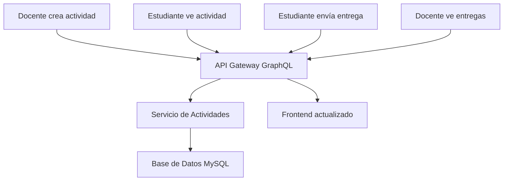

# 📚 Guía de Uso: Sistema de Actividades CourseClash

## 🎯 **Componentes Creados**

### **📁 Estructura de Archivos**

```
frontend/
├── components/activities/
│   ├── CreateActivityForm.tsx     # Formulario para crear actividades
│   ├── ActivityView.tsx          # Vista detallada de actividades
│   └── ActivityList.tsx          # Lista de actividades (ya existía)
└── app/curso/[id]/actividades/
    ├── page.tsx                  # Lista principal de actividades
    ├── crear/page.tsx           # Página para crear actividades
    └── [activityId]/page.tsx    # Vista de actividad específica
```

## 🎨 **Vista del Docente**

### **1. Crear Nueva Actividad**

**URL**: `/curso/{courseId}/actividades/crear`

**Características**:
- ✅ **Formulario completo** con validación
- ✅ **3 tipos de actividades**: Tarea, Quiz, Anuncio
- ✅ **Campos dinámicos** según el tipo seleccionado
- ✅ **Subida de archivos** con preview
- ✅ **Validaciones en tiempo real**
- ✅ **Interfaz moderna** con iconos y colores

```tsx
// Uso en un componente
import CreateActivityForm from '@/components/activities/CreateActivityForm';

<CreateActivityForm
  courseId={123}
  onSuccess={(activity) => console.log('Actividad creada:', activity)}
  onCancel={() => console.log('Cancelado')}
/>
```

**Ejemplo de actividad que se puede crear**:
```typescript
{
  courseId: 123,
  title: "Tarea de Cálculo Diferencial",
  activityType: "task",
  description: "Resolver los ejercicios del capítulo 5...",
  dueDate: "2024-02-15T23:59:00Z",
  fileUrl: "https://example.com/ejercicios.pdf"
}
```

### **2. Lista de Actividades (Vista Docente)**

**URL**: `/curso/{courseId}/actividades`

**Características para docentes**:
- ✅ **Botón "Nueva Actividad"** prominente
- ✅ **Estadísticas del curso**
- ✅ **Filtros por tipo** de actividad
- ✅ **Acciones rápidas** en cada actividad
- ✅ **Vista responsiva** con botón flotante en móvil

### **3. Vista Detallada (Docente)**

**URL**: `/curso/{courseId}/actividades/{activityId}`

**Funciones específicas del docente**:
- ✅ **Editar actividad**
- ✅ **Ver entregas de estudiantes**
- ✅ **Estadísticas de la actividad**
- ✅ **Eliminar actividad**

## 👨‍🎓 **Vista del Estudiante**

### **1. Lista de Actividades (Vista Estudiante)**

**URL**: `/curso/{courseId}/actividades`

**Características para estudiantes**:
- ✅ **Panel de estadísticas personales**: Pendientes, entregadas, vencidas
- ✅ **Filtros por estado**: Pendientes, entregadas, vencidas
- ✅ **Indicadores visuales** de estado
- ✅ **Sin botón de crear** (solo para docentes)

### **2. Vista Detallada de Actividad (Estudiante)**

**URL**: `/curso/{courseId}/actividades/{activityId}`

**Características principales**:

#### **📋 Información de la Actividad**
- ✅ Título, descripción y tipo
- ✅ Fecha límite con indicador de vencimiento
- ✅ Archivos adjuntos del docente
- ✅ Comentarios e instrucciones

#### **📝 Sistema de Entregas**
- ✅ **Estado de entrega** (pendiente/entregada/vencida)
- ✅ **Formulario de entrega** con texto y archivos
- ✅ **Edición de entregas** (si está habilitado)
- ✅ **Visualización de calificaciones**
- ✅ **Historial de entregas**

#### **💡 Ayudas y Consejos**
- ✅ Tips para realizar la entrega
- ✅ Recordatorios de fecha límite
- ✅ Estado visual del progreso

```tsx
// Ejemplo de uso
<ActivityView
  activityId="123"
  userId="456"
  userRole="student"
/>
```

## 🚀 **Cómo Usar las Vistas**

### **Para Docentes:**

1. **Crear Actividad:**
   ```bash
   Ir a: /curso/123/actividades
   → Clic en "Nueva Actividad"
   → Llenar formulario
   → Enviar
   ```

2. **Gestionar Actividades:**
   ```bash
   → Ver lista de actividades
   → Clic en actividad específica
   → Usar botones de acción (Editar, Ver entregas, etc.)
   ```

### **Para Estudiantes:**

1. **Ver Actividades:**
   ```bash
   Ir a: /curso/123/actividades
   → Ver panel de estadísticas personales
   → Filtrar por estado (pendientes, entregadas, etc.)
   ```

2. **Realizar Entrega:**
   ```bash
   → Clic en actividad específica
   → Leer instrucciones
   → Clic en "Enviar Entrega"
   → Llenar formulario
   → Subir archivos (opcional)
   → Enviar
   ```

## 🎨 **Estados Visuales**

### **Tipos de Actividad:**
- 📝 **Tarea** (azul): Los estudiantes deben entregar trabajo
- ❓ **Quiz** (verde): Evaluación con preguntas
- 📢 **Anuncio** (amarillo): Información general

### **Estados de Entrega (Estudiantes):**
- ⏳ **Pendiente**: Aún no entregada
- ✅ **Entregada**: Trabajo enviado
- ⚠️ **Vencida**: Pasó la fecha límite
- 📊 **Calificada**: Ya tiene calificación

### **Indicadores de Fecha:**
- 📅 **Normal**: Fecha límite futura
- ⚠️ **Vencida**: Pasó la fecha límite (rojo)

## 🔄 **Flujo de Datos**



## 🛠️ **Personalización**

### **Cambiar rol de usuario:**
```typescript
// En las páginas, cambiar:
const mockUser = {
  id: '123',
  role: 'student' as 'student' | 'teacher', // Cambiar aquí
  name: 'Usuario de Prueba'
};
```

### **Personalizar tipos de actividad:**
```typescript
// En CreateActivityForm.tsx, función getActivityTypeInfo()
case 'nuevo_tipo':
  return {
    title: 'Nuevo Tipo',
    description: 'Descripción del nuevo tipo',
    icon: '🆕',
    color: 'bg-purple-50 border-purple-200 text-purple-800'
  };
```

## 📱 **Responsividad**

- ✅ **Diseño adaptativo** para móvil, tablet y desktop
- ✅ **Botón flotante** en móvil para crear actividades
- ✅ **Navegación táctil** optimizada
- ✅ **Formularios responsivos**

## 🔗 **Rutas Disponibles**

| Ruta | Vista | Rol | Descripción |
|------|-------|-----|-------------|
| `/curso/{id}/actividades` | Lista | Ambos | Lista de actividades del curso |
| `/curso/{id}/actividades/crear` | Formulario | Docente | Crear nueva actividad |
| `/curso/{id}/actividades/{activityId}` | Detalle | Ambos | Ver/entregar actividad |

## ✅ **Funcionalidades Implementadas**

### **Backend (Ya funcionando):**
- ✅ CRUD de actividades
- ✅ Sistema de entregas
- ✅ Calificaciones
- ✅ Comentarios
- ✅ Subida de archivos

### **Frontend (Recién creado):**
- ✅ Formulario de creación
- ✅ Vista de actividades
- ✅ Sistema de entregas
- ✅ Interfaz diferenciada por rol
- ✅ Estados visuales
- ✅ Navegación completa

## 🚀 **Próximos Pasos**

1. **Integrar autenticación real** (reemplazar mockUser)
2. **Implementar subida real de archivos**
3. **Añadir notificaciones en tiempo real**
4. **Crear dashboard de estadísticas para docentes**
5. **Implementar comentarios en actividades**
6. **Añadir sistema de calificaciones en el frontend**

¡El sistema está **listo para usar**! Solo cambia el `role` en `mockUser` para probar las diferentes vistas. 