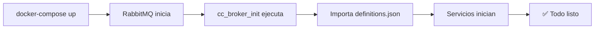
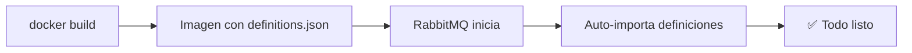

# 🎯 Integración Completa RabbitMQ - Opciones para el Equipo

## 🚀 Problema Resuelto

❌ **Antes:** Cada desarrollador tenía que hacer importación manual de `definitions.json`  
✅ **Ahora:** **TODO AUTOMATIZADO** - Solo ejecutar un comando

---

## 📋 **Opción 1: Inicializador Automático** ⭐ (Recomendada)

### **Qué incluye:**

- ✅ `docker-compose.yml` - Configuración principal con servicio inicializador
- ✅ `init_rabbitmq_definitions.sh` - Script que automáticamente importa definiciones
- ✅ `init_broker_automated.sh` - Script completo para el equipo
- ✅ `README_EQUIPO.md` - Documentación completa

### **Cómo funciona:**



### **Para tus compañeros:**

```bash
# Opción A: Simple
docker-compose up -d

# Opción B: Con script
./broker_service/init_broker_automated.sh
```

### **Ventajas:**

- ✅ No requiere build personalizado
- ✅ Fácil de mantener
- ✅ Fácil debugging
- ✅ Funciona con cualquier versión de RabbitMQ

---

## 📋 **Opción 2: Dockerfile Personalizado** (Alternativa)

### **Qué incluye:**

- ✅ `Dockerfile.rabbitmq` - Imagen personalizada de RabbitMQ
- ✅ `docker-entrypoint.sh` - Script de inicio que importa definiciones
- ✅ `docker-compose.alt.yml` - Configuración simplificada

### **Cómo funciona:**



### **Para tus compañeros:**

```bash
# Usar la versión personalizada
docker-compose -f broker_service/docker-compose.alt.yml up -d
```

### **Ventajas:**

- ✅ Más robusto
- ✅ Definiciones integradas en la imagen
- ✅ Menos servicios en docker-compose
- ✅ Mejor para producción

---

## 🔄 **Comparación de Opciones**

| Característica      | Inicializador | Dockerfile |
| ------------------- | ------------- | ---------- |
| **Facilidad setup** | ⭐⭐⭐⭐⭐    | ⭐⭐⭐     |
| **Facilidad debug** | ⭐⭐⭐⭐⭐    | ⭐⭐⭐     |
| **Robustez**        | ⭐⭐⭐⭐      | ⭐⭐⭐⭐⭐ |
| **Producción**      | ⭐⭐⭐        | ⭐⭐⭐⭐⭐ |
| **Mantenimiento**   | ⭐⭐⭐⭐⭐    | ⭐⭐⭐     |

---

## 🎯 **Recomendación Final**

### **Para Desarrollo (equipos pequeños):**

```bash
# Usar Opción 1: Inicializador
docker-compose up -d
```

### **Para Producción (equipos grandes):**

```bash
# Usar Opción 2: Dockerfile
docker-compose -f broker_service/docker-compose.alt.yml up -d
```

---

## 📁 **Archivos Creados para el Equipo**

```
broker_service/
├── definitions.json                    # Configuración RabbitMQ
├── init_rabbitmq_definitions.sh       # Script auto-importador
├── init_broker_automated.sh           # Script completo para equipo
├── README_EQUIPO.md                    # Documentación para equipo
├── Dockerfile.rabbitmq                # Imagen personalizada
├── docker-entrypoint.sh               # Script de entrada personalizado
├── docker-compose.alt.yml             # Docker-compose alternativo
└── INTEGRACION_COMPLETA.md            # Este archivo
```

---

## 🚀 **Para Nuevos Desarrolladores**

### **Setup en 30 segundos:**

```bash
# 1. Clonar repo
git clone [repo]
cd CourseClash

# 2. Ejecutar (elige una opción)
./broker_service/init_broker_automated.sh    # Opción 1
# O
docker-compose -f broker_service/docker-compose.alt.yml up -d  # Opción 2

# 3. ✅ Listo para desarrollar
```

### **Verificación:**

- 📊 RabbitMQ: http://localhost:15672 (`courseclash`/`courseclash123`)
- 🥊 Duel Service: http://localhost:8002
- 🔌 WebSocket: http://localhost:8003

---

## 🎉 **Resultado Final**

### **Lo que eliminamos:**

- ❌ Importación manual de `definitions.json`
- ❌ Comandos `curl` manuales
- ❌ Configuración de virtual hosts
- ❌ Creación manual de usuarios/permisos
- ❌ Problemas de "no access to vhost"

### **Lo que agregamos:**

- ✅ **Inicialización 100% automática**
- ✅ **Documentación completa**
- ✅ **Scripts listos para usar**
- ✅ **Dos opciones según necesidades**
- ✅ **Setup en menos de 1 minuto**

---

## 🎯 **Próximos Pasos**

1. **Elige la opción** que prefieras (Recomiendo Opción 1 para empezar)
2. **Comparte** `README_EQUIPO.md` con tus compañeros
3. **Prueba** que todo funciona
4. **Commit y push** todos los archivos
5. **¡Disfruta** del desarrollo sin configuración manual!

¡Tu equipo te va a agradecer! 🙌

## 🎯 **Próximos Pasos**

1. **Elige la opción** que prefieras (Recomiendo Opción 1 para empezar)
2. **Comparte** `README_EQUIPO.md` con tus compañeros
3. **Prueba** que todo funciona
4. **Commit y push** todos los archivos
5. **¡Disfruta** del desarrollo sin configuración manual!

¡Tu equipo te va a agradecer! 🙌
