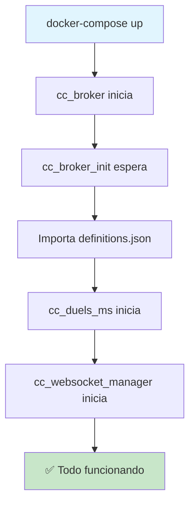

# 🎯 Guía para el Equipo - Broker RabbitMQ Automatizado

## 🚀 Inicio Rápido (Solo un comando)

### Para desarrolladores nuevos en el proyecto:

```bash
# 1. Clonar el repositorio
cd CourseClash

# 2. Ejecutar inicialización automática
./broker_service/init_broker_automated.sh
```

### Para desarrolladores existentes:

```bash
# Opción A: Inicio simple (usando docker-compose)
docker-compose up -d

# Opción B: Inicio controlado (usando script)
./broker_service/init_broker_automated.sh
```

## ✅ Qué hace la configuración automática

### 🔧 **Inicialización Automática:**

1. ✅ **RabbitMQ** se inicia con credenciales configuradas
2. ✅ **Inicializador** espera a que RabbitMQ esté listo
3. ✅ **Definiciones** se importan automáticamente (exchanges, queues, bindings)
4. ✅ **Servicios** se inician solo cuando RabbitMQ está completamente configurado

### 📋 **Sin pasos manuales:**

- ❌ No necesitas importar manualmente `definitions.json`
- ❌ No necesitas ejecutar comandos curl
- ❌ No necesitas configurar virtual hosts
- ❌ No necesitas crear usuarios o permisos

## 🛠️ Servicios Disponibles

| Servicio                   | URL                           | Credenciales                     |
| -------------------------- | ----------------------------- | -------------------------------- |
| 📊 **RabbitMQ Management** | http://localhost:15672        | `courseclash` / `courseclash123` |
| 🥊 **Duel Service**        | http://localhost:8002         | -                                |
| 📚 **Swagger API**         | http://localhost:8002/swagger | -                                |
| 🔌 **WebSocket Manager**   | http://localhost:8003         | -                                |

## 📐 Arquitectura Automatizada



## 🔍 Verificación

### Verificar que todo funciona:

```bash
# Ver estado de todos los servicios
docker-compose ps

# Ver logs en tiempo real
docker-compose logs -f cc_broker cc_duels_ms cc_websocket_manager

# Verificar RabbitMQ Management
curl http://localhost:15672

# Verificar Duel Service
curl http://localhost:8002/swagger/index.html
```

### En RabbitMQ Management UI:

1. Ve a http://localhost:15672
2. Login: `courseclash` / `courseclash123`
3. Deberías ver:
   - **Exchanges:** `duels.topic`, `users.topic`, `courses.topic`
   - **Queues:** `duel.critical.events`, `websocket.events`, etc.
   - **Virtual Host:** `/courseclash`

## 🛠️ Comandos Útiles

### Desarrollo diario:

```bash
# Iniciar todos los servicios
docker-compose up -d

# Detener todos los servicios
docker-compose down

# Ver logs específicos
docker-compose logs cc_duels_ms
docker-compose logs cc_websocket_manager

# Reiniciar un servicio específico
docker-compose restart cc_duels_ms
```

### Solución de problemas:

```bash
# Limpiar y empezar de cero
docker-compose down
docker volume rm courseclash_rabbitmq_data
./broker_service/init_broker_automated.sh

# Ver logs del inicializador
docker-compose logs cc_broker_init
```

## 🚨 Solución de Problemas

### Problema: "RabbitMQ no está disponible"

```bash
# Solución:
docker-compose restart cc_broker
sleep 10
docker-compose up cc_broker_init
```

### Problema: "Servicio de duelos no conecta"

```bash
# Verificar logs:
docker-compose logs cc_duels_ms

# Solución:
docker-compose restart cc_duels_ms
```

### Problema: "Definiciones no están aplicadas"

```bash
# Verificar:
curl -u courseclash:courseclash123 http://localhost:15672/api/exchanges/%2Fcourseclash

# Re-ejecutar inicializador:
docker-compose up cc_broker_init
```

## 📋 Configuración para Nuevos Entornos

### Variables de entorno importantes:

```env
# En docker-compose.yml ya configuradas:
RABBITMQ_URL=amqp://courseclash:courseclash123@cc_broker:5672/%2Fcourseclash
RABBITMQ_DEFAULT_USER=courseclash
RABBITMQ_DEFAULT_PASS=courseclash123
RABBITMQ_DEFAULT_VHOST=/courseclash
```

### Archivos importantes:

- `broker_service/definitions.json` - Configuración de RabbitMQ
- `broker_service/init_rabbitmq_definitions.sh` - Script de inicialización
- `docker-compose.yml` - Orquestación de servicios

## 🎯 Para Producción

### Consideraciones de seguridad:

1. 🔐 Cambiar credenciales por defecto
2. 🛡️ Usar secretos de Docker/Kubernetes
3. 🌐 Configurar TLS/SSL
4. 📊 Configurar monitoreo

### Configuración recomendada:

```yaml
# En docker-compose.prod.yml
environment:
  - RABBITMQ_DEFAULT_USER=${RABBITMQ_USER}
  - RABBITMQ_DEFAULT_PASS=${RABBITMQ_PASS}
  - RABBITMQ_URL=${RABBITMQ_URL}
```

---

## 🎉 ¡Eso es todo!

Con esta configuración, cualquier miembro del equipo puede:

1. **Clonar el repo**
2. **Ejecutar un comando**
3. **Empezar a desarrollar**

¡Sin configuración manual! 🚀
